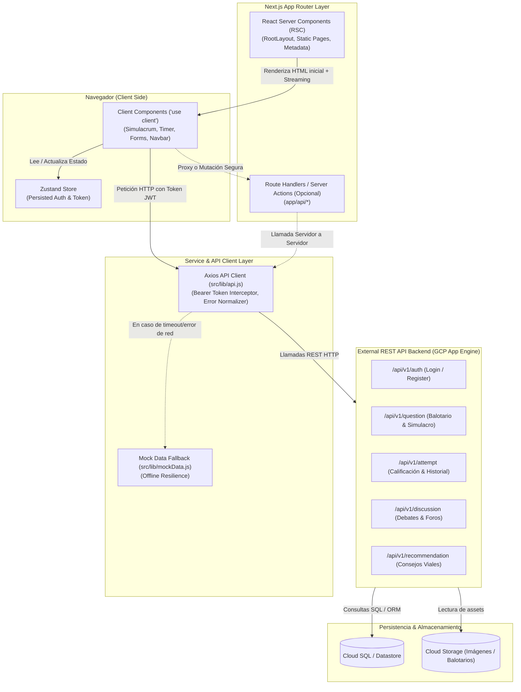

# Web Chepita MTC - Simulador de Examen de Reglas de Tránsito

Aplicación web interactiva para la preparación y práctica del examen oficial de reglas de tránsito del MTC (Ministerio de Transportes y Comunicaciones de Perú), construida con Next.js 16, React 19 y Tailwind CSS v4.

---

## Next.js Architecture & Data Flow for AI

**Web Chepita MTC** es una plataforma orientada a la preparación integral para la obtención de licencias de conducir en Perú, implementada sobre la arquitectura **Next.js App Router (v16.3.6)** con una estrategia de renderizado híbrido. La aplicación prioriza el uso de **React Server Components (RSC)** en el nivel de layout y páginas de catálogo para optimizar el rendimiento inicial, el SEO y el Largest Contentful Paint (LCP), delegando el renderizado interactivo en el cliente (**Client Components**) únicamente a los nodos interactivos como el temporizador de 40 minutos del simulacro, el selector reactivo de alternativas, el almacenamiento local de sesión vía Zustand y las animaciones con Framer Motion / Canvas Confetti. Las solicitudes de datos viajan desde los componentes interactivos del cliente hacia una capa de servicios tipada que consume la API REST de Chepita alojada en Google Cloud Platform mediante tokens Bearer autenticados.



---

## Getting Started

### 1. Requisitos Previos
- Node.js 20+ o 22 (recomendado Node.js 22, correspondiente al runtime de producción en `app.yaml`).
- npm, pnpm o yarn.

### 2. Configurar Variables de Entorno
Copia la plantilla `.env.example` a `.env.local`:

```bash
cp .env.example .env.local
```

### 3. Instalar Dependencias
```bash
npm install
```

### 4. Iniciar Servidor de Desarrollo
```bash
npm run dev
```

Abre [http://localhost:3000](http://localhost:3000) en tu navegador para ver la aplicación.

---

## Scripts Disponibles

- `npm run dev`: Inicia el servidor de desarrollo local con Hot Reload.
- `npm run build`: Compila y genera el bundle de producción optimizado.
- `npm run gcp-build`: Script de compilación específico para Google Cloud App Engine.
- `npm run start`: Inicia el servidor en modo producción.
- `npm run lint`: Ejecuta el linter (ESLint 9 con reglas de Next.js).

---

## Despliegue en Google Cloud App Engine

El proyecto está configurado para desplegarse como servicio `web-chepita-mtc` en runtime `nodejs22` según [`app.yaml`](file:///e:/chepita-dev/chepita.mtc/web-chepita-mtc/app.yaml):

```bash
gcloud app deploy app.yaml
```
